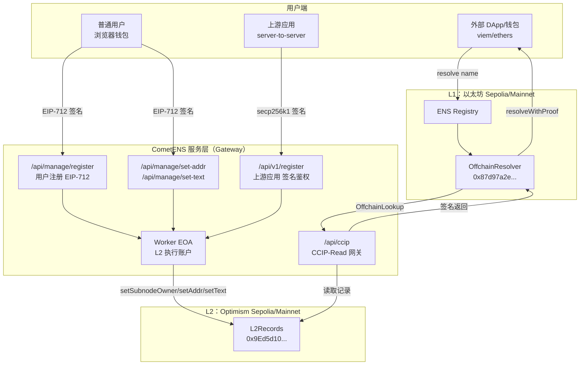
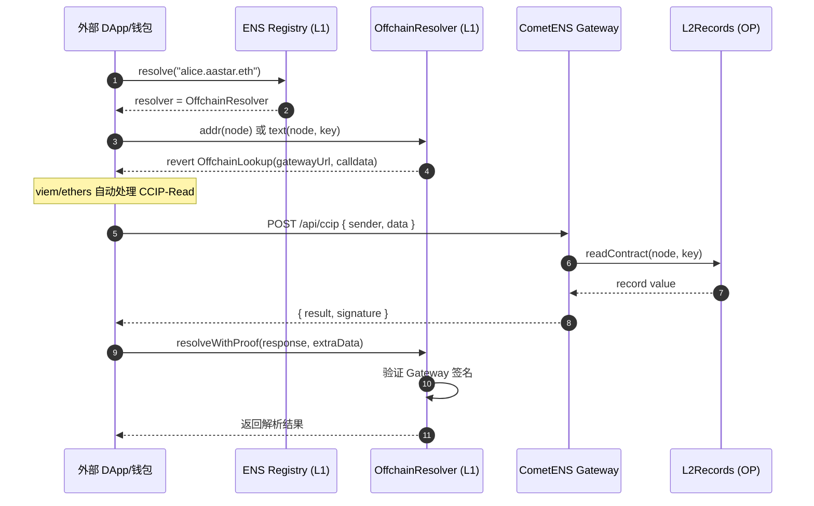
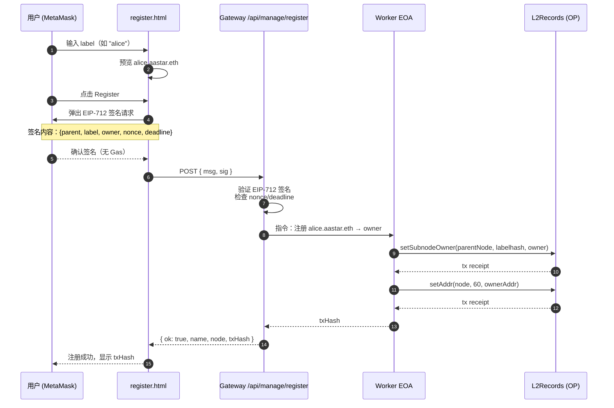
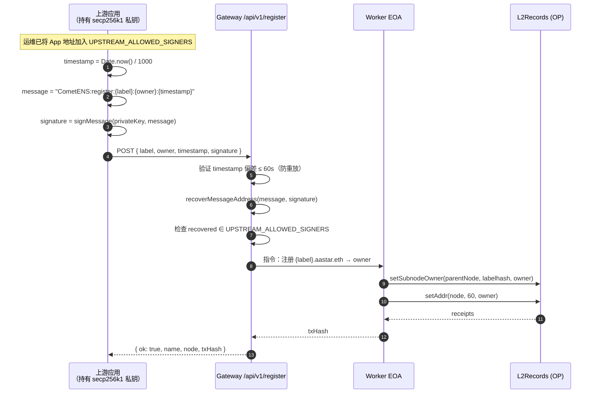
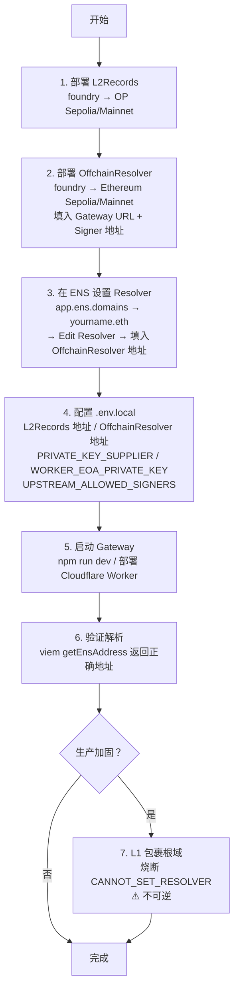
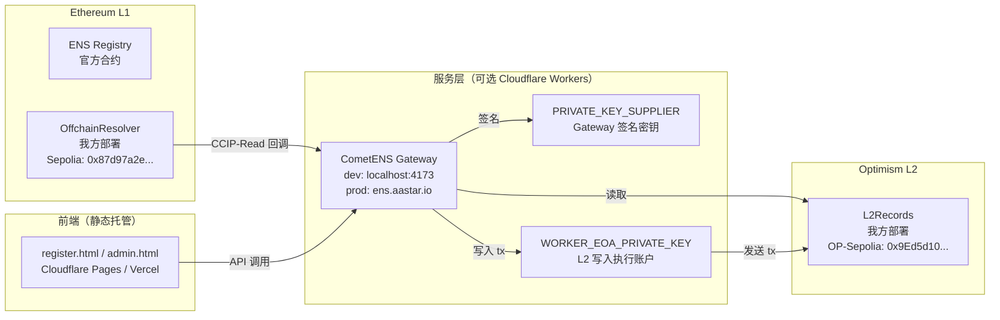

# CometENS 架构总览

本文档从不同视角描述 CometENS 的架构，每张图对应一个关注维度。

---

## 图 1：系统全景（组件关系）

所有角色与组件在一张图中的位置关系。

---

## 图 2：ENS 解析流程（外部 DApp/钱包视角）

任何使用 viem/ethers 的应用解析 `alice.aastar.eth` 时发生的完整流程。

> 对 DApp 开发者完全透明，标准 `publicClient.getEnsAddress("alice.aastar.eth")` 即可。

---

## 图 3：普通用户注册流程（前端 EIP-712）

用户通过 `/register.html` 注册子域名的完整流程。

---

## 图 4：上游应用自动注册流程（机器间 API）

上游应用（如用户注册系统）在用户创建账号时自动分配 ENS 子域名。

---

## 图 5：运维/部署者操作流程

从零开始搭建 CometENS 实例的操作序列。

---

## 图 6：部署拓扑

各组件的部署位置与运行环境。

---

## 各角色快速入口

| 角色 | 关注的图 | 操作文档 |
|------|----------|----------|
| 外部 DApp / 钱包 | 图2：解析流程 | 直接使用标准 ENS API，无需任何配置 |
| 普通用户 | 图3：前端注册 | [MANUAL.md Part 2](../MANUAL.md) |
| 上游应用开发者 | 图4：API 接入 | [MANUAL.md Part 3](../MANUAL.md) |
| 运维/部署者 | 图5+6：部署 | [DEPLOY.md](../DEPLOY.md) |
